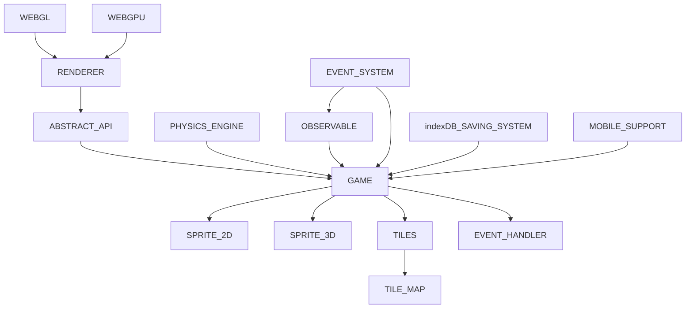

This engine is all open source, feel free to take it, change it and use it as you wish. if you want, contact me, I'm a beginner in the world of rendering, so all suggestions are welcome. if this library was useful, please, consider making a donation. Thanks and good use.

## INTENTION

this engine is intended to be more like a library, very lightweight, without the use of any additional external libraries. Also, the engine's purpose is to be beginner friendly, something like **microsoft make code arcade** ([see here](https://arcade.makecode.com/)). This repository is intended to be either a documentation and a sort of book of journeys ([check here](https://github.com/alle0017/game-library/blob/main/material%20for%20getting%20started.md)), for the once who wants to learn how to program an engine, from how webgl and webgpu works to the game algorithms.

# ARCHITECTURE IDEA

# RENDERER

## TABLE OF CONTENTS
-[append](#append)\
-[setAttributes](#setattributes)\
-[remove](#remove)\
-[draw](#draw)\
-[DrawOpt](#drawopt)\
-[DrawableImageOptions](#drawableelementoptions)\
-[Point3D](#point3d)\
-[Point2D](#point2d)

``` typescript
import { Shapes } from './rendering/shapes.js';
import { Renderer } from './rendering/GPURenderer.js'; // './rendering/GLRenderer.js'; 
const color = [...] //your colors data
const renderer = new Renderer( myCanvas );
await renderer.init(); // initialize the renderer
const myCube = renderer.create({
      ...Shapes.cube( 0.1 ),
      color,
      perspective: true // use Perspective in your object
});
renderer.append( 'cube', myCube );
const f = ()=>{
      // if you want to make dynamic your object use renderer.setAttributes('myCube', { opt... })
      renderer.draw();;
      requestAnimationFrame(f);
}
f();
```
### create
``` typescript
create( DrawableElementAttributes ): RenderFunction
```
\
accept [DrawableElementAttributes](#drawableelementoptions) as parameter and create new instance of RenderFunction, that represents the way in which the render will draw your object on the canvas.

### append
``` typescript
append( string, RenderFunction ): Renderer;
```
\
accept string and RenderFunction as parameter. Start rendering what RenderFunction represents. the string is an identifier for that specific object.

### setAttributes
``` typescript
setAttributes( string, DrawOpt ): Renderer;
```
\
accept string and [DrawOpt](#drawopt) as parameter. Changes the values of the object (specified by the string accepted as first argument) attributes on rendering. if not necessary, don't call this function.

### remove
``` typescript
remove( string ): RenderFunction;
```
\
remove the object named with the string passed as first argument. return the RenderFunction deleted.

### draw
``` typescript
draw(): void;
```
\
draw all the objects actually attached to the renderer

### DrawOpt 
``` typescript
type DrawOpt = {
      //angle of rotation
      angle?: number;
      /**
       * 'x' 'y' or 'z'. which axis is used to rotate the object around.
       */
      axis?: Axis;
      /**
       * whether or not to convert angle to radiants
       */
      toRad?: boolean;
      /**
       * the rotation matrix 3d, so a 4x4 matrix ( you can use Matrix.rotate to get once)
       * @see Matrix in matrix.ts
       */
      rotationMatrix?: number[];
      /**
       * the translation matrix 3d, so a 4x4 matrix ( you can use Matrix.translate to get once)
       * @see Matrix in matrix.ts
       */
      translationMatrix?: number[];
      /**
       * 3d vector that translate (moves) the element in the space
       */
      translation?: Point3D;
      /**
       * projection matrix 
       */
      projectionMatrix?: number[];
      /**
      * the scale to use for reduce/enlarge objects
      */
      scale?: number | Point3D;
      /**
      * the scale matrix 3d, so a 4x4 matrix ( you can use Matrix.scale to get once)
      * @see Matrix in matrix.ts
      */
      scaleMatrix?: number[];
      /**
      * camera matrix 
      *@see Camera in camera.ts
      */
      camera?: Camera;
      transformationMatrix?: number[];
      /**
       * vectors that indicate where the actual frame and costume of image atlas (sprite sheet) you want to draw
       */
      animationVector?: [number, number];
      bumpScale?: number;
}
```

### DrawableElementOptions
``` typescript
type DrawableElementOptions = {
      // color vector 
      color: number[];
      // index buffer 
      indices: number[];
      // if you want a single-colored static object
      staticColor: Color;
      // if you want an object that cannot move or change (default to false)
      static: boolean;
      // wether or note to use perspective (default to false)
      perspective: boolean;
      /**
      * @see DrawableImageOptions
      */
      imageData: DrawableImageOptions;
};
```
### DrawableImageOptions
```typescript
type DrawableImageOptions = {
      // coordinates of the texture in the space
      textureCoords: number[];
      //image to use
      image: ImageBitmap; 
      //if you want to animate your image
      animate?: boolean;
      // image used for displacement mapping
      displacementMap?: ImageBitmap;
}
```
### Point3D
```typescript
type Point3D = {
      x: number,
      y: number,
      z: number,
}
```
### Point2D
```typescript
type Point2D = {
      x: number,
      y: number,
}
```

## NEXT STEPS

- [ ] webgpu texture (on going)
- [x] webgpu uniforms
- [ ] webgl texture (on going)
- [x] webgl uniforms
- [x] re-implement the WebGL renderer 
- [ ] implement lights 
- [ ] implement skeletal animations
- [ ] implement a fallback system with possibility of require specific api for the renderer (on going)