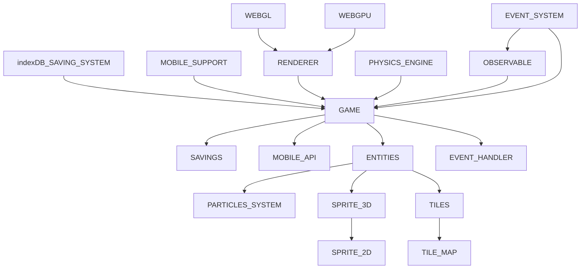

This engine is all open source, feel free to take it, change it and use it as you wish. if you want, contact me, I'm a beginner in the world of rendering, so all suggestions are welcome. if this library was useful, please, consider making a donation. Thanks and good use.

## INTENTION

this engine is intended to be more like a library, very lightweight, without the use of any additional external libraries. Also, the engine's purpose is to be beginner friendly, something like **microsoft make code arcade** ([see here](https://arcade.makecode.com/)). This repository is intended to be either a documentation and a sort of book of journeys ([check here](https://github.com/alle0017/game-library/blob/main/material%20for%20getting%20started.md)), for the once who wants to learn how to program an engine, from how webgl and webgpu works to the game algorithms.

# TABLE OF CONTENTS
### ARCHITECTURE 
-[architecture](#architecture-idea)
### PROJECT TREE
-[tree](#folder-structure)
### API
##### RENDERER METHODS
-[append](#append)\
-[setAttributes](#setattributes)\
-[remove](#remove)\
-[draw](#draw)
##### TYPES
-[DrawOpt](#drawopt)\
-[DrawableImageOptions](#drawableelementoptions)\
-[Point3D](#point3d)\
-[Point2D](#point2d)
### NEXT STEPS
-[Next step](#next-steps-1)
### DOCUMENTATION
-[Documentation](#documentation)

# ARCHITECTURE IDEA

# FOLDER STRUCTURE
```
game library
├─ .DS_Store
├─ .vscode
│  └─ settings.json
├─ controller
│  └─ loadData.ts
├─ entities
├─ icon.webp (test image)
├─ index.d.ts (delete when vscode supports webgpu types)
├─ index.html (test file)
├─ main.ts (test file)
├─ material for getting started.md
├─ pipeline.jpg (test image)
├─ prova.png (test image)
├─ readme.md
├─ rendering
│  ├─ .DS_Store
│  ├─ GLRenderer.ts
│  ├─ GPURenderer.ts
│  ├─ codeDelegates
│  │  ├─ GLcode.ts
│  │  └─ GPUcode.ts
│  ├─ matrix
│  │  ├─ camera.ts
│  │  ├─ matrices.ts
│  │  └─ viewMatrix.ts
│  ├─ programSetterDelegate.ts
│  ├─ rendererModel.ts
│  ├─ shaders
│  │  ├─ GLShaders.ts
│  │  ├─ GPUShader.ts
│  │  └─ shaderModel.ts
│  ├─ shapes.ts
│  ├─ tree.ts
│  └─ types.ts
├─ src
│  ├─ controller
│  │  └─ loadData.js
│  ├─ entities
│  │  └─ entity.js
│  ├─ main.js
│  └─ rendering
│     ├─ GLRenderer.js
│     ├─ GPUrenderer.js
│     ├─ codeDelegates
│     │  ├─ GLcode.js
│     │  └─ GPUcode.js
│     ├─ generics.js
│     ├─ matrix
│     │  ├─ camera.js
│     │  ├─ matrices.js
│     │  └─ viewMatrix.js
│     ├─ programSetterDelegate.js
│     ├─ rendererModel.js
│     ├─ shaders
│     │  ├─ GLShaders.js
│     │  ├─ GPUShader.js
│     │  └─ shaderModel.js
│     ├─ shapes.js
│     ├─ tree.js
│     └─ types.js
├─ tsconfig.json 
└─ vertex.txt (old data)

```

## RENDERER METHODS
``` typescript
import { Shapes } from './rendering/shapes.js';
import { Renderer } from './rendering/GPURenderer.js'; // './rendering/GLRenderer.js'; 
const color = [...] //your colors data
const renderer = new Renderer( myCanvas );
await renderer.init(); // initialize the renderer
const myCube = renderer.create({
      ...Shapes.cube( 0.1 ),
      color,
      perspective: true // use Perspective in your object
});
renderer.append( 'cube', myCube );
const f = ()=>{
      // if you want to make dynamic your object use renderer.setAttributes('myCube', { opt... })
      renderer.draw();
      requestAnimationFrame(f);
}
f();
```
### create
``` typescript
create( DrawableElementAttributes ): RenderFunction
```
\
accept [DrawableElementAttributes](#drawableelementoptions) as parameter and create new instance of RenderFunction, that represents the way in which the render will draw your object on the canvas.

### append
``` typescript
append( string, RenderFunction ): Renderer;
```
\
accept string and RenderFunction as parameter. Start rendering what RenderFunction represents. the string is an identifier for that specific object.

### setAttributes
``` typescript
setAttributes( string, DrawOpt ): Renderer;
```
\
accept string and [DrawOpt](#drawopt) as parameter. Changes the values of the object (specified by the string accepted as first argument) attributes on rendering. if not necessary, don't call this function.

### remove
``` typescript
remove( string ): RenderFunction | undefined;
```
\
remove the object named with the string passed as first argument. return the RenderFunction deleted.

### draw
``` typescript
draw(): void;
```
\
draw all the objects actually attached to the renderer
## TYPES
### DrawOpt 
``` typescript
type DrawOpt = {
      //angle of rotation
      angle?: number;
      /**
       * 'x' 'y' or 'z'. which axis is used to rotate the object around.
       */
      axis?: Axis;
      /**
       * whether or not to convert angle to radiants
       */
      toRad?: boolean;
      /**
       * the rotation matrix 3d, so a 4x4 matrix ( you can use Matrix.rotate to get once)
       * @see Matrix in matrix.ts
       */
      rotationMatrix?: number[];
      /**
       * the translation matrix 3d, so a 4x4 matrix ( you can use Matrix.translate to get once)
       * @see Matrix in matrix.ts
       */
      translationMatrix?: number[];
      /**
       * 3d vector that translate (moves) the element in the space
       */
      translation?: Point3D;
      /**
       * projection matrix 
       */
      projectionMatrix?: number[];
      /**
      * the scale to use for reduce/enlarge objects
      */
      scale?: number | Point3D;
      /**
      * the scale matrix 3d, so a 4x4 matrix ( you can use Matrix.scale to get once)
      * @see Matrix in matrix.ts
      */
      scaleMatrix?: number[];
      /**
      * camera matrix 
      *@see Camera in camera.ts
      */
      camera?: Camera;
      transformationMatrix?: number[];
      /**
       * vectors that indicate where the actual frame and costume of image atlas (sprite sheet) you want to draw
       */
      animationVector?: [number, number];
      bumpScale?: number;
}
```

### DrawableElementOptions
``` typescript
type DrawableElementOptions = {
      // color vector 
      color: number[];
      // index buffer 
      indices: number[];
      // if you want a single-colored static object
      staticColor: Color;
      // if you want an object that cannot move or change (default to false)
      static: boolean;
      // wether or note to use perspective (default to false)
      perspective: boolean;
      /**
      * @see DrawableImageOptions
      */
      imageData: DrawableImageOptions;
};
```
### DrawableImageOptions
```typescript
type DrawableImageOptions = {
      // coordinates of the texture in the space
      textureCoords: number[];
      //image to use
      image: ImageBitmap; 
      //if you want to animate your image
      animate?: boolean;
      // image used for displacement mapping
      displacementMap?: ImageBitmap;
}
```
### Point3D
```typescript
type Point3D = {
      x: number,
      y: number,
      z: number,
}
```
### Point2D
```typescript
type Point2D = {
      x: number,
      y: number,
}
```

## NEXT STEPS

### LEGEND
- done: "already implemented"
- on-going: "actually working at..."
- coming soon: "the next step"
- ideally: "if possible, in the future will be supported"

<table>
<tr>
      <th> 
            checklist
      </th>
      <th>
            feature
      </th>
      <th>
            status
      </th>
</tr>
<tr>
      <td>
            [x] 
      </td>
      <td>
            webgpu texture
      </td>
      <td>
            done
      </td>
</tr>
<tr>
      <td>
            -[x] 
      </td>
      <td>
            webgpu dynamic bindings definition ( create an array of all the bindings) 
      </td>
      <td>
            done
      </td>
</tr>
<tr>
      <td>
            [x] 
      </td>
      <td>
            webgpu uniforms
      </td>
      <td>
            done
      </td>
</tr> 
<tr>
      <td>
            [ ] 
      </td>
      <td>
            webgl texture
      </td>
      <td>
            on-going
      </td>
</tr>
<tr>
      <td>
            [x] 
      </td>
      <td>
            webgl uniforms
      </td>
      <td>
            done
      </td>
</tr>
<tr>
      <td>
            [ ] 
      </td>
      <td>
            implement lights
      </td>
      <td>
            coming soon
      </td>
</tr>
<tr>
      <td>
            [ ] 
      </td>
      <td>
            implement skeletal animations
      </td>
      <td>
            coming soon
      </td>
</tr>
<tr>
      <td>
            [ ] 
      </td>
      <td>
            implement a fallback system with possibility of require specific api for the renderer
      </td>
      <td>
            on-going
      </td>
</tr>
</table>

## DOCUMENTATION
this section contains all the material used to study rendering (by me), and that I'd thought could be helpful for the beginners
### WebGL
[-WebGL Fundamentals](https://webglfundamentals.org/)\
[-Mozilla docs](https://developer.mozilla.org/en-US/docs/Web/API/WebGL_API/Tutorial/Getting_started_with_WebGL)

### WebGPU
[-WebGPU Step By Step](https://github.com/jack1232/WebGPU-Step-By-Step)\
[-Raw WebGPU](https://alain.xyz/blog/raw-webgpu)\
[-code labs google tutorial](https://codelabs.developers.google.com/your-first-webgpu-app#6)\
[-Mozilla docs](https://developer.mozilla.org/en-US/docs/Web/API/WebGPU_API)\
[-WebGPU Fundamentals](https://webgpufundamentals.org/)

### VARIOUS RENDERING TECHNIQUES

[-Skeletal Animation](https://veeenu.github.io/blog/implementing-skeletal-animation/)\
[-WebGPU API for C++](https://eliemichel.github.io/LearnWebGPU/introduction.html)\
[-WebGPU for Metal developers](https://metalbyexample.com/webgpu-part-two/)\
[-Render grass](https://www.youtube.com/watch?v=bp7REZBV4P4&t=401s)