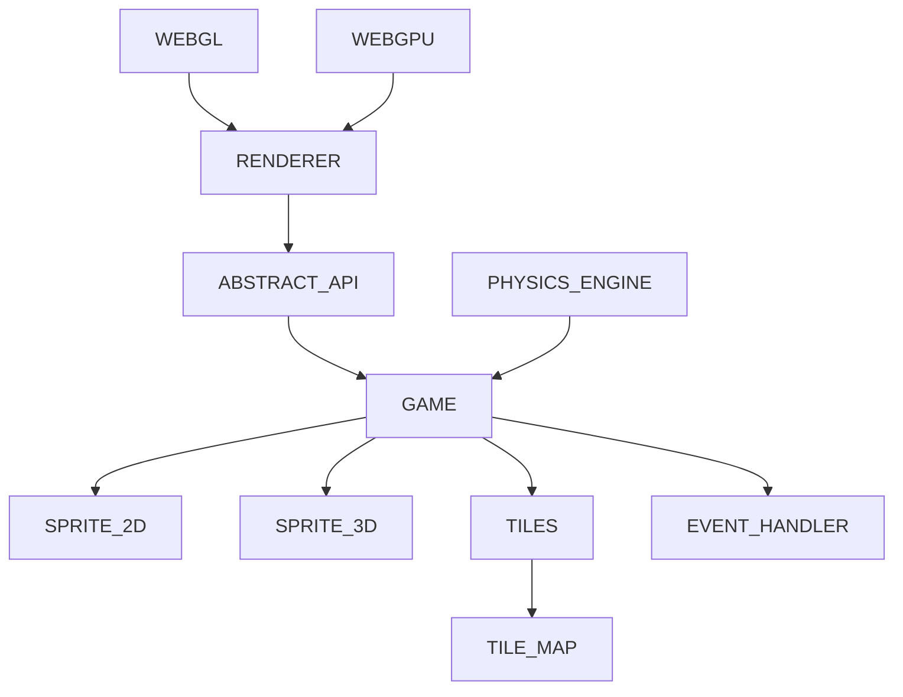

This engine is all open source, feel free to take it, change it and use it as you wish. if you want, contact me, I'm a beginner in the world of rendering, so all suggestions are welcome. if this library was useful, please, consider making a donation. Thanks and good use.

## INTENTION

this engine is intended to be more like a library, very lightweight, without the use of any additional external libraries. Also, the engine's purpose is to be beginner friendly, something like **microsoft make code arcade** ([see here](https://arcade.makecode.com/)). This document is intended to be either a documentation and a sort of book of journeys, for the once who wants to learn how to program an engine, from how webgl and webgpu works to the game algorithms.

# ARCHITECTURE IDEA

# RENDERER

## NEXT STEPS

- [ ] webgpu texture (on going)
- [x] webgpu uniforms (on going)
- [ ] webgl texture (on going)
- [ ] webgl uniforms (on going)
- [x] re-implement the WebGL renderer 
- [ ] implement lights 
- [ ] implement skeletal animations
- [ ] implement a fallback system with possibility of require specific api for the renderer (on going)