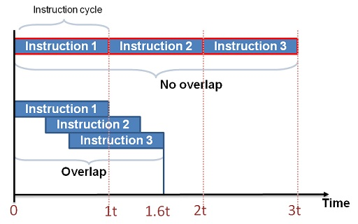

This engine is all open source, feel free to take it, change it and use it as you wish. if you want, contact me, I'm a beginner in the world of rendering, so all suggestions are welcome. if this library was useful, please, consider making a donation. Thanks and good use.

## INTENTION

this engine is intended to be more like a library, very lightweight, without the use of any additional external libraries. Also, the engine's purpose is to be beginner friendly, something like **microsoft make code arcade** ([see here](https://arcade.makecode.com/)). This document is intended to be either a documentation and a sort of book of journeys, for the once who wants to learn how to program an engine, from how webgl and webgpu works to the game algorithms.

# RENDERER

## NEXT STEPS

- [ ] webgpu texture
- [ ] webgpu uniforms
- [ ] re-implement the WebGL renderer
- [ ] implement lights 
- [ ] implement skeletal animations
- [ ] implement a fallback system with possibility of require specific api for the renderer

## MATERIAL FOR GETTING STARTED 

this material is intended to be the absolute starting point for the once that have never touched rendering before. i will collect all the material that I'm currently using to study here.

## INDEX
- [how it works](#how-it-works)
- [buffers](#buffers)
- [shaders](#shaders)
- [rendering pipeline](#rendering-pipeline)
- [WebGL documentation](#webgl)
- [WebGPU documentation](#webgpu)

## HOW IT WORKS

the fist step is to understand how webgl and webgpu works. Either the api's are very different from each other, in fact, webgl works as linear as possible, making it very easy to understand for beginners. in the other hand, webgpu use the rendering pipeline, that optimize the rendering phase a lot, but makes it more difficult to understand, for the once who comes from an high level language, such as javascript. let's start with the general concepts.

### BUFFERS

Also in "traditional programming", the only methods of sharing resources between processes/programs is to use buffers. Generically, they are only region of memory (like arrays) that you can access (with pointers, a primitive data type of low level languages, that can refers to cells of memory) and take data from it. in rendering, they are used basically for all the exchanges of data, but, practically, the once more interesting are:
-index buffer;
-vertex buffer;
-uniform buffer;
 
#### index buffer 
 this type of buffer is unique for each program and, basically, say how the vertex buffer must be read. for example, suppose we have a 3-array [5,6,7] and suppose we have an index buffer that contains [0,2,1]. Normally, the array will be read as 5,6,7 in order; With the index buffer the order changes and the new sequence will be [5,7,6]. this is very useful, because, if you have a cube, you will normally have a vertex buffer of size 6 (2 triangles of 3 vertex each with 3 components each) for each face (6) for a total of 108 values: You can use an index buffer to reduce this number to 4 (number of vertices of a square with 3 components each) times 6 = 72 and an index buffer of 36 values ( initial values divided by 3 ) for a total of 108 values. So 108 = 108, why do we use index buffer? two reasons: first, normally, index buffer is composed of 16 bit sized unsigned int, while vertex by 32 bits floats, for a total of 360 bytes with index buffer usage and 432 bytes without. Second, not always the index buffer usage produces the same number of data of the other case, but we can say that it's use can reduce the number of data, increasing the speed of execution.

### SHADERS

### RENDERING PIPELINE

 In order to understand the rendering pipeline, i will explain how it works: fist, the pipeline is filled with commands that can be executed by the gpu. when the gpu receives the commands, it executes them, as queue, making the execution very efficient. To more easy understand this concept , let's try to understand also webgl api's: Webgl send the commands once each, so the gpu will act as a sort of bodyguard, that prevents other programs to be run in row, as you can see in the following example:      At the end of the execution, that data will be understood by the gpu only as an image, without depth (no more depth test), so, if you want to make more objects interact between each others, you have to draw them in the same pipeline.

### WebGL
[-WebGL Fundamentals](https://webglfundamentals.org/)\
[-Mozilla docs](https://developer.mozilla.org/en-US/docs/Web/API/WebGL_API/Tutorial/Getting_started_with_WebGL)

### WebGPU
[-WebGPU Step By Step](https://github.com/jack1232/WebGPU-Step-By-Step)\
[-Raw WebGPU](https://alain.xyz/blog/raw-webgpu)\
[-code labs google tutorial](https://codelabs.developers.google.com/your-first-webgpu-app#6)\
[-Mozilla docs](https://developer.mozilla.org/en-US/docs/Web/API/WebGPU_API)\
[-WebGPU Fundamentals](https://webgpufundamentals.org/)

### VARIOUS RENDERING TECHNIQUES

[-Skeletal Animation](https://veeenu.github.io/blog/implementing-skeletal-animation/)\
[-WebGPU API for C++](https://eliemichel.github.io/LearnWebGPU/introduction.html)\
[-WebGPU for Metal developers](https://metalbyexample.com/webgpu-part-two/)\
[-Render grass](https://www.youtube.com/watch?v=bp7REZBV4P4&t=401s)

