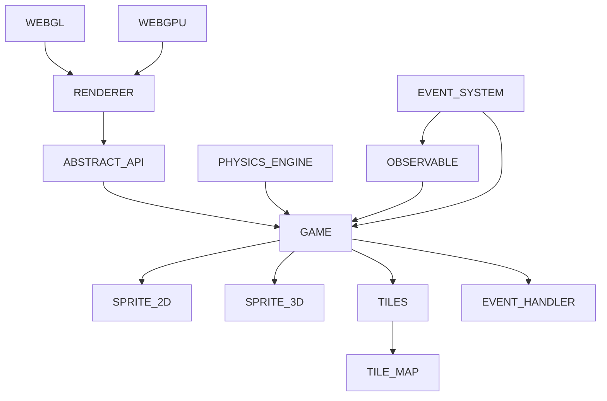

This engine is all open source, feel free to take it, change it and use it as you wish. if you want, contact me, I'm a beginner in the world of rendering, so all suggestions are welcome. if this library was useful, please, consider making a donation. Thanks and good use.

## INTENTION

this engine is intended to be more like a library, very lightweight, without the use of any additional external libraries. Also, the engine's purpose is to be beginner friendly, something like **microsoft make code arcade** ([see here](https://arcade.makecode.com/)). This repository is intended to be either a documentation and a sort of book of journeys ([check here](https://github.com/alle0017/game-library/blob/main/material%20for%20getting%20started.md)), for the once who wants to learn how to program an engine, from how webgl and webgpu works to the game algorithms.

# ARCHITECTURE IDEA

# RENDERER

``` typescript
import { Shapes } from './rendering/shapes.js';
import { Renderer } from './rendering/GPURenderer.js'; // './rendering/GLRenderer.js'; 
const color = [...] //your colors data
const renderer = new Renderer( myCanvas );
await renderer.init(); // initialize the renderer
const myCube = renderer.create({
      ...Shapes.cube( 0.1 ),
      color,
      perspective: true // use Perspective in your object
});
renderer.append( 'cube', myCube );
const f = ()=>{
      // if you want to make dynamic your object use renderer.setAttributes('myCube', { opt... })
      renderer.draw();;
      requestAnimationFrame(f);
}
f();
```
## NEXT STEPS

- [ ] webgpu texture (on going)
- [x] webgpu uniforms
- [ ] webgl texture (on going)
- [x] webgl uniforms
- [x] re-implement the WebGL renderer 
- [ ] implement lights 
- [ ] implement skeletal animations
- [ ] implement a fallback system with possibility of require specific api for the renderer (on going)